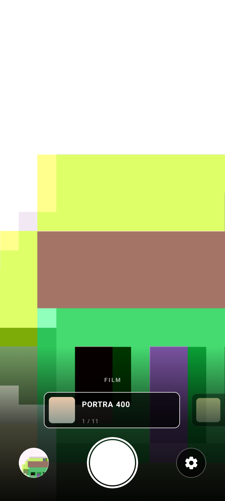
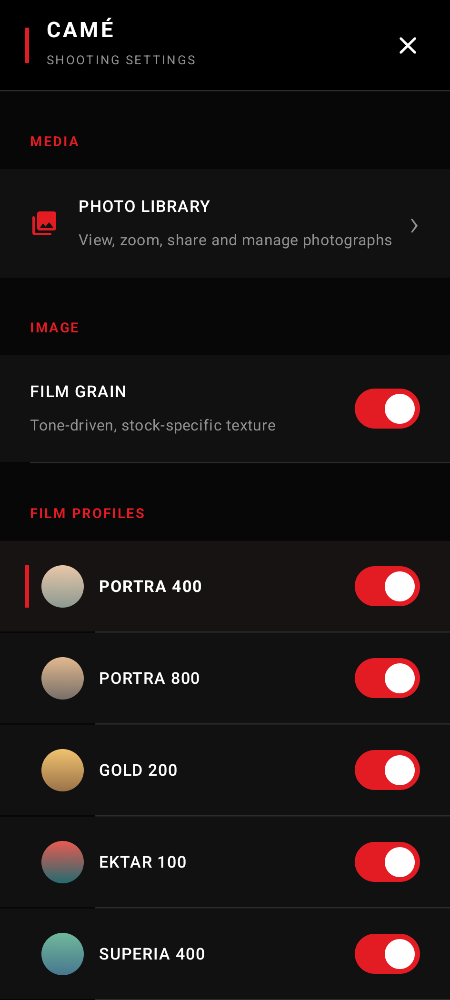
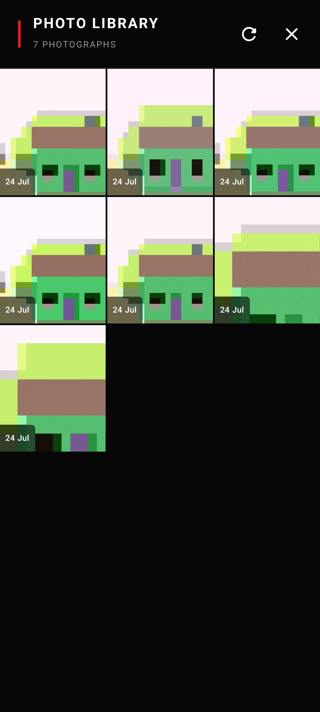

# camé

An intentionally focused Android camera. The viewfinder is the interface.

camé opens directly into a full-screen, GPU-filtered CameraX preview. A tactile shutter sits below
an animated horizontal film carousel, with the latest photograph and camera menu kept one tap
away. Hardware flash is off by default.

<p align="center">
  
  &nbsp;&nbsp;
  
  &nbsp;&nbsp;
  
</p>

## Interaction

- **Tap the image** — set autofocus and auto-exposure at that point.
- **Pinch the image** — frame a 1×–4× composition crop. The camera still captures and develops the
  complete frame; the crop is the final image operation.
- **Tap the EV badge** — roll the tactile thumbwheel through EV -2, -1, 0, +1, and +2.
- **Tap a lens ratio** — switch among the camera views reported by the device.
- **Swipe the film carousel** — preview and select an enabled film look, or tap a neighbouring
  card to glide it into the centre.
- **Tap the shutter** — take a photograph, immediately or after the configured delay; an armed
  self-timer shows beside the flash badge.
- **Tap the thumbnail** — open the in-app photo library and full-screen viewer.
- **Tap the gear** — open the full-screen camera menu.
- **Point at a QR code** — when it contains a web address, tap the link that appears in the
  viewfinder.
- **Volume key** — take a photograph without touching the screen.

The menu uses a high-contrast, Fujifilm-inspired information hierarchy. It controls film grain,
the optional gyroscope-driven electronic level, which looks are in the carousel, the self-timer,
app updates, and access to the photo library.
The viewer supports pinch/pan, double-tap, and button zoom up to 8×, previous/next navigation,
reset, metadata, sharing, and deletion.

## Film looks

The profiles are adapted from the scene-aware film work in
[`Nielk74/ricoh-gr3-android`](https://github.com/Nielk74/ricoh-gr3-android). camé keeps their stock
identity while using a native GPU preview transform for immediate feedback and a deterministic
full-resolution renderer for the saved photograph. Grain varies with tone, not neighbouring
detail, so focus and subject texture do not change its physical character. Its random field lives
in film coordinates rather than output pixels, and the crystal response is integrated analytically
over each pixel's footprint on the emulsion, so a preview holds the area-average of the same field
the export samples and grain keeps its physical size at any output resolution.

Two of the stock responses are selective rather than global. Vegetation greens rotate toward
cyan-green and open sky toward cyan, each at its original linear-light luminance, gated by a soft
hue/chroma/tone likelihood and — for sky — connectivity to the top of the frame, so skin, blue
clothing, and signage keep their own colour. Halation is a two-lobe response computed in linear
light: a broad red-biased base reflection and a tighter emulsion scatter, composited with each
pixel's own highlight core subtracted so it reads as a fringe around a bright edge rather than a
wash over it. Its radius scales with output size, so a preview and a full-resolution capture show
the same halo.

The stocks are tuned for computational-camera input. A Pixel-class capture arrives already
tone-mapped and saturated, which leaves a film response authored against a flat scan with very
little left to say, so each stock's authored deviation from its own neutral response is amplified —
through a soft limit, so a restrained stock is not driven into the same look as an expressive one,
and asymmetrically, so a deliberately flat stock stays flat instead of turning washed out.

Included at launch: Portra 400, Portra 800, Gold 200, Ektar 100, Superia 400, CineStill 800T,
Vision3 250D, Vision3 500T, Eterna Cinema, Tri-X 400, and HP5 Plus.

Each stock is represented by a square crop of a compact side/end face from its real box or respool
packaging—or the lid of its bulk can—from the
[Film Packaging Archive](https://fp-archive.com/film_packaging/by_brand.html). Exact scan references
and the archive's image-use notice are recorded in
[the asset manifest](docs/FILM_PACKAGING_ASSETS.md).

## Pixel capture development

On devices that expose them, camé asks CameraX for the vendor's automatic extension, with HDR as
a fallback; availability and concurrent image-analysis support are always checked at runtime.
Google lists the Pixel 8 family among
[CameraX extension-capable devices](https://developer.android.com/media/camera/supported-devices),
and Android documents the available
[Auto and HDR extension modes](https://developer.android.com/media/camera/camerax/extensions-api).
Still capture uses CameraX's quality-first mode and a 100-quality JPEG source.

On multi-camera phones, camé reads CameraX's
[physical camera information and intrinsic zoom ratios](https://developer.android.com/reference/androidx/camera/core/CameraInfo)
to suggest currently usable fields of view. Selecting one changes the logical camera's zoom
ratio, allowing Android's
[multi-camera pipeline](https://developer.android.com/media/camera/camera2/multi-camera) to choose
or fuse the appropriate sensor while preserving the live session. A phone exposing only one
usable lens keeps the selector hidden.

At 1× the viewfinder fits the frame rather than filling the screen, letterboxed on a tall phone,
and the preview and capture are pinned to one aspect ratio. Pinching scales that same 4:3 frame
around its centre; the full-resolution film pipeline still runs first, then the matching centred
crop is cut from the finished photograph.

Rendering a full-resolution photograph through the whole pipeline takes a few seconds, and camé
treats that as the cost of the picture rather than something to trim. While it works, the
viewfinder dims and names the stage in progress — developing, recovering sky, printing the stock,
halation, grain, saving — beside the packaging of the stock in the pipeline, with the run laid out
as a trail of dots. Only the stages that photograph will actually reach are shown: halation and
grain depend on the stock and on the grain setting.

Before a film stock is applied, the saved photograph passes through a restrained scene-adaptive
development stage: guarded percentile levels, a stable trimmed-midpoint exposure curve, and
edge-aware local tonal separation. It is deliberately light-handed — the tonal character is the
stock's job, so the develop stage sets a dependable exposure and leaves the look to the emulsion.

That stage also recovers a washed-out sky. Exposing for the subject leaves a bright sky running up
against the top of the range, arriving pale and close to neutral, so camé pulls its brightness back
and takes red down further than blue — returning colour rather than only making a grey sky darker.
Sky is identified by flood-filling bright, flat, cool regions back to the top edge of the frame,
which distinguishes it from any other bright flat surface, and each pixel is then gated on its own
brightness and colour so the correction stops at the skyline rather than leaving a darkened band
beneath it. A sky that is already a deep blue is left nearly alone.

None of this is presented as a replacement for Pixel
HDR+: Google's pipeline aligns and merges a
[burst of RAW frames before tone mapping](https://research.google/pubs/burst-photography-for-high-dynamic-range-and-low-light-imaging-on-mobile-cameras/),
which cannot be recreated from one processed JPEG. camé keeps its advanced filtered output in
standard JPEG because Android's
[Ultra HDR editing guidance](https://developer.android.com/media/grow/ultra-hdr/edit) notes that
filters can invalidate the existing gain map unless the editor updates it to match.

## Privacy

camé has no account, ads, analytics, or network upload. Photographs stay in Android's media
library, and QR recognition runs entirely on the device. Network access is used only to check this
repository's public GitHub Releases feed and download an update after you accept it; opening a
recognized link is handed to Android's normal browser.

## Build

Requirements: JDK 17 and an Android SDK containing API 34.

```sh
./gradlew test lint assembleDebug
```

The debug APK is written under `app/build/outputs/apk/debug/`.

## Releases and in-app updates

Tags matching `v*` run the release workflow. CI tests and lints the source, builds a signed APK
and AAB, verifies the APK signature, produces a SHA-256 checksum, and publishes all three assets
to GitHub Releases. The app discovers installable releases across the paginated public feed,
verifies the checksum when present, and hands the APK to Android's normal installer confirmation.

Repository maintainers must configure `KEYSTORE_B64`, `STORE_PASSWORD`, `KEY_ALIAS`, and
`KEY_PASSWORD` as GitHub Actions secrets before pushing a release tag.

## License

[MIT](LICENSE)
